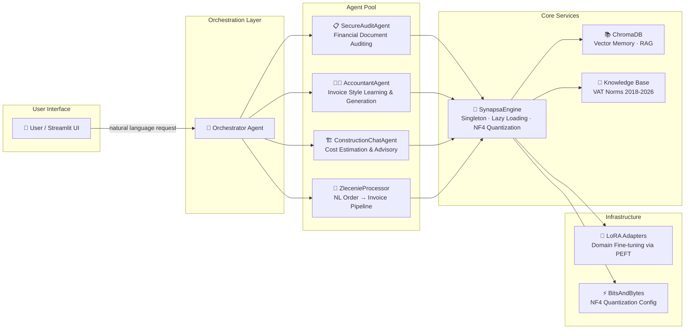

<p align="center">
  <h1 align="center">🧠 Synapsa AI Framework</h1>
  <p align="center">
    <em>Autonomous, Self-Improving AI Engineering Ecosystem for Local Deployment</em>
  </p>
  <p align="center">
    
    
    
    
    
    
  </p>
</p>

---

## 🎯 Problem

Small and medium-sized businesses in Poland rely heavily on manual document processing — invoicing, cost estimation, financial auditing — typically handled through spreadsheets or expensive cloud software. Local AI solutions exist, but they either require cloud API keys (privacy risk) or run unoptimized models that consume 16+ GB VRAM on consumer hardware.

## 💡 Solution

**Synapsa** is a fully local, privacy-first AI ecosystem that runs on consumer-grade GPUs (≥6 GB VRAM). It provides:

- **Autonomous Multi-Agent System** — Specialized agents (Auditor, Accountant, Construction Estimator) collaborate through an orchestrator to process complex business workflows.
- **Self-Healing Code Loop** — A feedback mechanism where the agent detects errors in its own output, analyzes the stack trace, and self-corrects without human intervention.
- **Optimized Local Inference** — Qwen 2.5 Coder 7B quantized to NF4 (4-bit Normal Float) via `bitsandbytes`, reducing VRAM usage by ~40% while maintaining inference quality.
- **RAG-Powered Context** — ChromaDB-backed Retrieval-Augmented Generation provides agents with project-specific memory and domain knowledge (e.g., Polish VAT norms 2018–2026).

---

## 🏗️ Architecture



### Data Flow

```
User Input (PL/EN)
  → Orchestrator (intent classification)
    → Agent Selection (Audit / Accountant / Construction / Zlecenie)
      → [Optional] RAG Context Retrieval (ChromaDB)
      → LLM Inference (Qwen 2.5 · NF4 · LoRA)
        → Output Parsing & Validation
          → [If error] Self-Healing Loop (retry with stack trace)
            → Structured Response (JSON / Invoice / Report)
```

---

## 📂 Project Structure

```
synapsa/                    # Core package (src equivalent)
├── engine.py               # SynapsaEngine — Singleton, lazy model loading, NF4 quantization
├── hardware.py             # GPU/CPU detection, VRAM profiling
├── compat.py               # Windows compatibility layer (Triton stubs, etc.)
├── install_helper.py       # Smart dependency installer (CPU/GPU auto-detect)
├── agents/
│   ├── office_agent.py     # SecureAuditAgent — document auditing with VAT norms
│   ├── accountant_agent.py # AccountantAgent — style learning + invoice generation
│   ├── construction_agent.py # ConstructionChatAgent — cost estimation
│   └── zlecenie_processor.py # ZlecenieProcessor — NL → cost estimate → invoice pipeline
└── knowledge/
    └── vat_norms.json      # Historical VAT norms (2018–2026)

tests/                      # Test suite
├── test_business_logic.py  # Unit tests for parsers, calculators, validators
├── test_norms.py           # VAT norms validation
├── eval_rag.py             # RAG evaluation script (Context Recall, Answer Relevance)
└── ...                     # Integration & E2E tests

docs/
└── adr/                    # Architecture Decision Records
    ├── 0001-model-selection-qwen.md
    └── 0002-vector-db-chroma.md

configs/
└── quantization.yaml       # NF4 quantization configuration

.github/workflows/ci.yml    # CI pipeline (lint + test)
Dockerfile                  # Multi-stage optimized build
docker-compose.yml          # One-command deployment
pyproject.toml              # Modern dependency management
BENCHMARKS.md               # VRAM optimization measurements
```

---

## ⚙️ Key Features

### 🤖 Multi-Agent Architecture
Each agent is a self-contained class with:
- **Lazy initialization** — model loads only on first inference call
- **Offline fallback** — deterministic rule-based responses when GPU/model is unavailable
- **File isolation** — all file operations use a safe-zone copy pattern (originals are never modified)

### 🔄 Self-Healing Code Loop
The audit agent implements a **state-machine feedback loop**:

```
[GENERATE] → [VALIDATE] → [OK?] → Yes → Return Result
                              ↓ No
                         [ANALYZE ERROR]
                              ↓
                         [INJECT STACK TRACE INTO PROMPT]
                              ↓
                         [REGENERATE] (max 3 retries)
```

This isn't a simple `while` retry — each iteration enriches the prompt with the specific error context, enabling the model to learn from its mistakes within the same session.

### 📊 RAG with Domain Knowledge
- **Vector Store:** ChromaDB with persistent local storage
- **Knowledge Base:** Historical Polish VAT norms (2018–2026) enabling year-aware invoice auditing
- **Chunking Strategy:** Document-level for invoices, paragraph-level for regulations

### ⚡ Memory Optimization
Achieved **~40% VRAM reduction** through:
- NF4 (4-bit Normal Float) quantization via `bitsandbytes`
- Double quantization (`bnb_4bit_use_double_quant=True`)
- `float16` compute dtype
- LoRA adapters (PEFT) instead of full fine-tuning

See [BENCHMARKS.md](BENCHMARKS.md) for detailed measurements.

---

## 🚀 Quick Start

### Prerequisites
- Python 3.10+
- NVIDIA GPU with ≥6 GB VRAM (or CPU-only mode with degraded performance)
- CUDA 12.x toolkit

### Option 1: Docker (Recommended)
```bash
git clone https://github.com/yourusername/synapsa.git
cd synapsa
docker-compose up --build
```

### Option 2: Local Installation
```bash
git clone https://github.com/yourusername/synapsa.git
cd synapsa

# Create virtual environment
python -m venv venv
venv\Scripts\activate        # Windows
# source venv/bin/activate   # Linux/macOS

# Install dependencies
pip install -e ".[dev]"

# Install AI libraries (auto-detects CPU/GPU)
python -m synapsa.install_helper

# Run the application
streamlit run app_budowlanka.py
```

### Option 3: Pre-built Distribution
Download the latest release from the [Releases](https://github.com/yourusername/synapsa/releases) page and run:
```bash
START_BUDOWLANKA.bat   # Windows
```

---

## 🧪 Testing

```bash
# Run unit tests
pytest tests/test_business_logic.py -v

# Run all tests
pytest tests/ -v

# Run RAG evaluation
python tests/eval_rag.py

# Lint & format
pre-commit run --all-files
```

---

## 📖 Documentation

| Document | Description |
|----------|-------------|
| [BENCHMARKS.md](BENCHMARKS.md) | VRAM optimization measurements and methodology |
| [ADR: Model Selection](docs/adr/0001-model-selection-qwen.md) | Why Qwen 2.5 over Llama 3 |
| [ADR: Vector DB](docs/adr/0002-vector-db-chroma.md) | Why ChromaDB over Qdrant |

---

## 🛠️ Tech Stack

| Layer | Technology |
|-------|------------|
| **LLM Engine** | Qwen 2.5 Coder 7B Instruct (NF4 quantized) |
| **Fine-tuning** | LoRA via PEFT + Unsloth |
| **Quantization** | bitsandbytes (NF4, double quant) |
| **Vector Memory** | ChromaDB (persistent local) |
| **Backend** | FastAPI (async) |
| **Frontend** | Streamlit |
| **Containerization** | Docker (multi-stage build) |
| **CI/CD** | GitHub Actions |
| **Code Quality** | Black, isort, Ruff, Mypy |

---

## 📜 License

This project is licensed under the MIT License — see the [LICENSE](LICENSE) file for details.