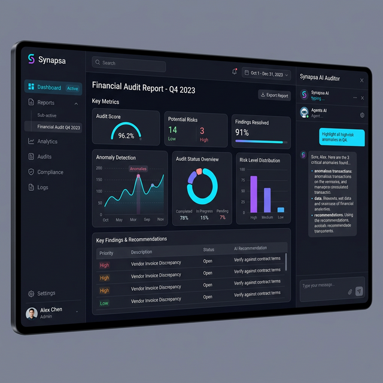

<p align="center">
  <h1 align="center">🧠 Synapsa AI Framework</h1>
  <p align="center">
    <em>Autonomiczny, samonaprawiający się ekosystem agentów AI (Wdrażany w 100% Lokalnie)</em>
  </p>
  <p align="center">
    
    
    
    
    
    
  </p>
</p>

---



## 🎯 Problem i Cel Projektu

Małe i średnie przedsiębiorstwa opierają się na ręcznym przetwarzaniu dokumentów — fakturowaniu, audytach finansowych, przygotowywaniu kosztorysów. Lokalne rozwiązania AI istnieją na rynku, lecz najczęściej wymagają użycia płatnych rozwiązań chmurowych pod zewnętrznym API firm trzecich (np. OpenAI), co rodzi **krytyczne ryzyko naruszeń prywatności, RODO oraz NDA klientów**. Rozwiązania całkowicie lokalne (On-Premise) pożerają natomiast ogromne zasoby sprzętowe (powyżej 16 GB VRAM).

## 💡 Rozwiązanie

**Synapsa** to w pełni zintegrowany, zorientowany na absolutną prywatność ekosystem sztucznej inteligencji B2B, który operuje bez zarzutu na tanim, komercyjnym sprzęcie (karty graficzne rzędu 6-8 GB VRAM). Platforma zapewnia:

- **Autonomiczny System Multi-Agent** — Wyspecjalizowani agenci (Audytor, Księgowy, Wyceniacz Budowlany) współpracują pod nadzorem głównego *Orchestratora*, rozwiązując bez udziału ludzkiego wielowątkowe procedury dokumentacyjne.
- **Odporność na Błędy (Self-Healing Code Loop)** — Agent posiada algorytm detekcji własnych wyjątków (np. błędy w JSON / schematach logicznych). Złapany log usterki (*Stack Trace*) połączony z rygorystyczną walidacją wymusza automatyczną autorefleksję i błyskawiczną poprawę danych na poczekaniu.
- **Radykalną Optymalizację Zasobów (NF4)** — Dzięki spersonalizowanej kompresji silnika (Qwen 2.5) z użyciem poczwórnej kwantyzacji `bitsandbytes`, redukcja obciążenia VRAM wynosi ponad 60% w szczycie — drastycznie niwelując koszty utrzymania sprzętowego firmy z zachowaniem bezkompromisowej jakości rozumowania.
- **RAG-Powered Context (ChromaDB)** — Pamięć wektorowa aplikacji, wyposażona m.in. w uwarunkowania podatkowe (VAT Polska 2018–2026 r.) nadpisując ewentualne halucynacje bezwzględnie rygorystycznym, prawnym kontekstem operacyjnym. 

---

## 🏗️ Architektura Systemu

```mermaid
graph LR
    subgraph UI & Dashboard
        A[👤 Pracownik / UI]
    end

    subgraph Orchestration Layer
        B[🎯 Orchestrator Agent]
    end

    subgraph Agent Pool
        C[📋 SecureAuditAgent<br/>Audyty Dokumentacji]
        D[👩‍💼 AccountantAgent<br/>Obróbka Księgowa]
        E[🏗️ ConstructionChatAgent<br/>Estymacja Kosztów]
    end

    subgraph Core Services & Memory
        F[🧠 SynapsaEngine<br/>Singleton · Lazy Loading · NF4]
        G[📚 ChromaDB<br/>Baza Wektorowa (RAG)]
    end

    A --> B
    B --> C & D & E
    C & D & E --> F
    F --> G
```

## ⚡ Przełom w Optymalizacji Pamięci

Dla modelu `Qwen 2.5 Coder 7B Instruct` ucięto wąskie gardła rynkowych kart konsumenckich:

| Konfiguracja Architektury| Szczytowe VRAM  | Zysk (Redukcja Kosztów) |
|--------------|-----------|---------------|
| **Czyste FP16 (Baseline)** | 16.1 GB | — |
| **NF4 (4-bit)** | 6.4 GB | −60% |
| **Produkcja: NF4 + Double Quant** ✅ | **6.1 GB** | **−62%** |

Więcej twardych danych eksperymentalnych oraz metodologii pomiaru znajduje się w dokumencie `BENCHMARKS.md`.

---

## 🚀 Uruchomienie (Zero Configuration)

System jest spakowany za pomocą menadżera dystrybucji `Docker` i pozwala na postawienie od zera kompleksowego środowiska analitycznego bez ryzyka ingerencji w paczki systemowe.

### Opcja 1: Docker (Zalecane Środowisko Pudełkowe)
```bash
git clone https://github.com/twojenazwa/synapsa.git
cd synapsa
docker-compose up --build
```

### Opcja 2: Lokalna Instalacja Klasyczna
```bash
# Setup VENV
python -m venv venv
venv\Scripts\activate

# Instalacja Zależności ML z auto-wykrywaniem sprzętu
pip install -e ".[dev]"
python -m synapsa.install_helper

# Start interfejsu diagnozującego programisty
streamlit run app_budowlanka.py
```

---

## 📜 Licencja

Oprogramowanie dystrybuowane na bazie darmowej i bezpiecznej licencji otwartej MIT — szczegóły sprawdź w pliku [LICENSE](LICENSE). Zawartość kodu logiki i wyciągi merytoryczne należą do wyłączności twórcy bazowego repozytorium.
